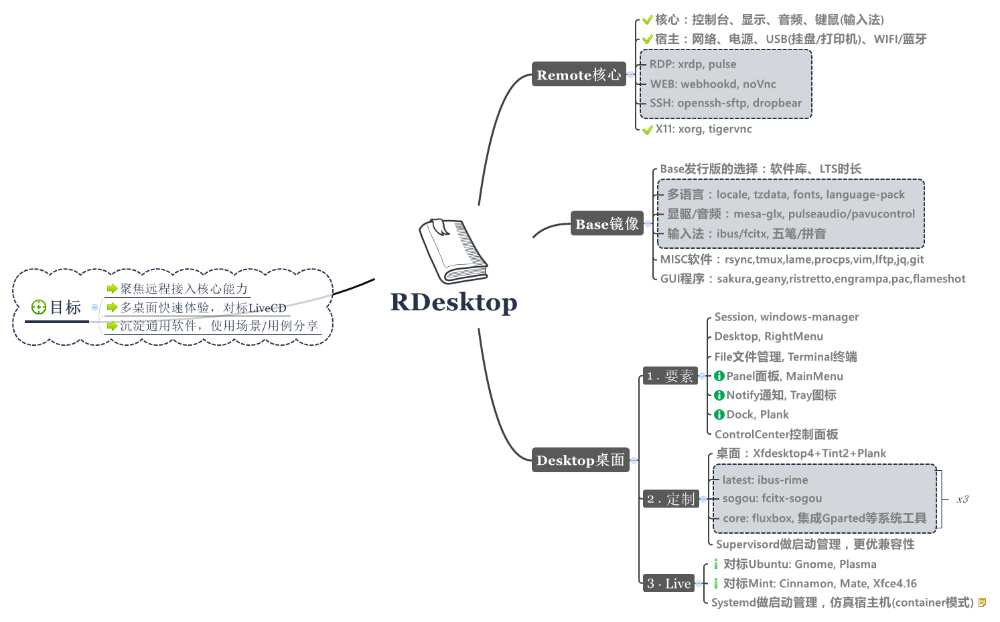

# docker-headless

Multi-Desktop with `XRDP/NOVNC/PulseAudio` based on `Ubuntu20.04`, Formatting a HeadlessBox/Cloud Desktop. [[Detail]](./Detail.md)

[](https://hub.docker.com/r/infrastlabs/docker-headless/tags)
[](https://hub.docker.com/r/infrastlabs/docker-headless)
[](https://www.github.com/infrastlabs/docker-headless)
[](https://www.github.com/infrastlabs/docker-headless/issues)

## step1: QuickStart

`docker run -it --rm --shm-size 1g --net=host infrastlabs/docker-headless`

 -- | Conn | PASS | ReadOnly 
--- | ---  | ---  | ---
noVnc | https://192.168.0.x:10081 | `headless` | `View123` 
RDP   | 192.168.0.x:10089         | `headless` | - 
SSH   | ssh -p 10022 headless@192.168.0.x | `headless` | - 


**Design**

- Screen shared with both RDP/noVnc. (ReadWrite/ReadOnly)
- MultiScreen support. (mstsc+xrdp+tigervnc)
- Audio support. (xrdp+pulseaudio/noVNC+broadcast)
- Locale/TZ support.
- Desktop apps: ibus-rime/fcitx-sogou, flameshot, PAC.
- Slim image: `core: 170.53 MB(fluxbox)`, `latest: 277.48 MB(ibus,xfce4.14)`, `sogou: 354.15 MB(fcitx)`



## step3: UseCase

Quick start with Locale: `docker run -it --rm --shm-size 1g -e VNC_OFFSET=20 -e L=zh_CN --net=host infrastlabs/docker-headless:latest`, Prefer [docker-compose.yml](./docker-compose.yml)

**(1)Development** (java, golang, nodejs)

```bash
# JAVA
sudo apt -y install openjdk-8-jdk openjdk-8-source && sudo apt -y install maven 
# GO
goVer=go1.17.8 #go1.16.15 #go1.13.15
wget https://studygolang.com/dl/golang/$goVer.linux-amd64.tar.gz
tar -zxf $goVer.linux-amd64.tar.gz; mv go $goVer.linux-amd64
rm -f godev; ln -s $goVer.linux-amd64 godev #link godev
# NODE
wget https://npm.taobao.org/mirrors/node/v14.20.0/node-v14.20.0-linux-x64.tar.xz
xz -d node-v14.20.0-linux-x64.tar.xz #tar.xz消失
tar -xvf node-v14.20.0-linux-x64.tar

# cat >> /etc/profile <<EOF
cat <<EOF |sudo tee -a /etc/profile
# NODE
NODE_HOME=/_ext/down/node-v14.20.0-linux-x64
PATH=\$NODE_HOME/bin:\$PATH
export NODE_HOME PATH
# GO
GO_HOME=/_ext/down/godev
GOPATH=/_ext/gopath
PATH=\$GO_HOME/bin:\$GOPATH/bin:\$PATH
export GO_HOME GOPATH PATH
export GO111MODULE=on
export GOPROXY=https://goproxy.cn
EOF

#IDE: vscode, ideaIC
wget https://vscode.cdn.azure.cn/stable/6cba118ac49a1b88332f312a8f67186f7f3c1643/code_1.61.2-1634656828_amd64.deb
wget https://download.jetbrains.com.cn/idea/ideaIC-2016.3.8-no-jdk.tar.gz
```


**(2)Office**

wps, chrome/firefox

```bash
# firefox, chromium
sudo apt -y install firefox-esr chromium #chromium-driver
# WPS Office
# https://blog.csdn.net/u012939880/article/details/89439647 #wps_symbol_fonts.zip
wget https://wdl1.cache.wps.cn/wps/download/ep/Linux2019/10161/wps-office_11.1.0.10161_amd64.deb
# ibus support with wps
sudo sed -i "1a export XMODIFIERS=@im=ibus" /usr/bin/{wps,wpp,et}
sudo sed -i "2a export QT_IM_MODULE=ibus" /usr/bin/{wps,wpp,et}
```


**(3)Docker Dind**


```bash
# exec@host: docker,dcp
img=docker:18.09.8 #18.09.3
docker run -v /_ext:/mnt $img sh -c "cp /usr/local/bin/docker /mnt; ls -lh /mnt |grep docker"
img=registry.cn-shenzhen.aliyuncs.com/k-bin/sync-kube:kube-att
docker run --rm -v /_ext:/mnt $img sh -c 'cp -a /down/docker-compose /mnt/; ls -lh /mnt |grep docker'

# links@HeadlessBox: docker, socket
sudo bash -c "ln -s /_ext/docker /bin/; ln -s /_ext/docker-compose /usr/bin/dcp"
sudo bash -c "ln -s /mnt/var/run/docker.sock /var/run/; chmod 777 /var/run/docker.sock"
```
